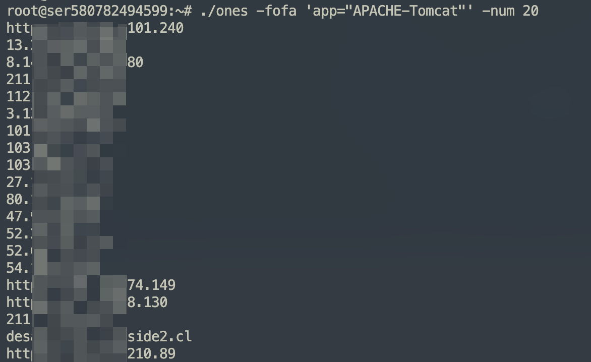
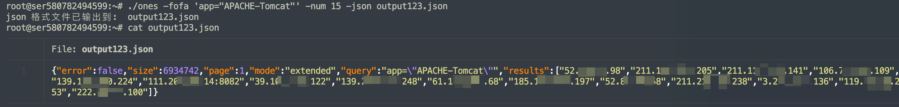
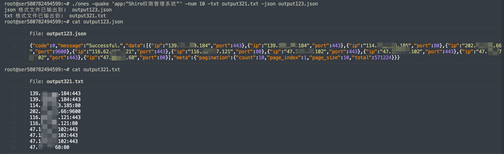
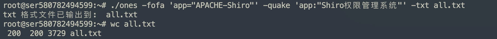
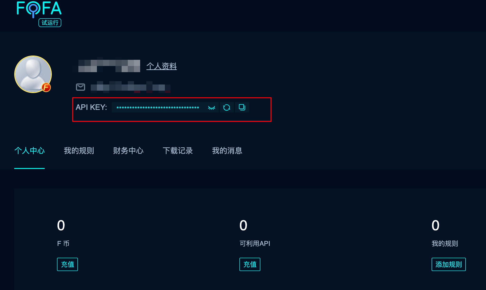
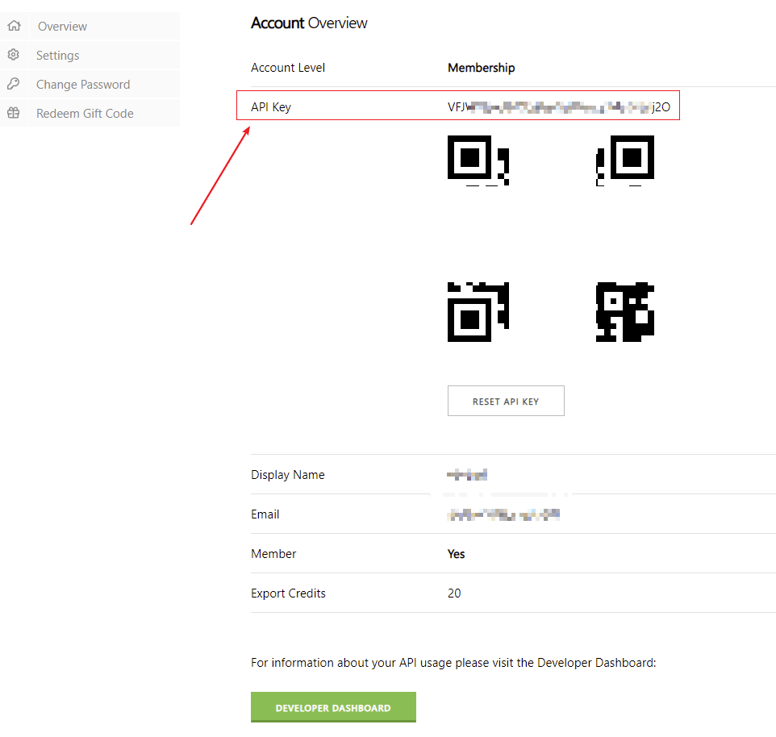

# ones

可用于多个网络资产测绘引擎 API 的命令行查询工具,写个2个版本,一个 go 版本,一个 bash shell 脚本的版本

---

## 开始

### go 版本使用

**1. 下载**
- 从 [releases](https://github.com/ffffffff0x/ones/releases) 进行下载

**2. 创建配置文件**

将下方字段中的 key 改为你自己的,如果不填就保留默认的 xxxx
```bash
tee ones.conf <<-'EOF'
{
  "fofa_email": "changme@163.com",
  "fofa_key": "xxxxxxxxxxxxxxxxxxxxxxxxxxxxxxx",
  "zoom_key": "xxxxxxxx-xxxx-xxxxx-xxxx-xxxxxxxxxx",
  "shodan_key": "xxxxxxxxxxxxxxxxxxxxxxxxxxxxxxxxx",
  "quake_key": "xxxxxxxx-xxxx-xxxx-xxxx-xxxxxxxxxx",
  "hunter_key": "xxxxxxxxxxxxxxxxxxxxxxxxxxxxxxxxxxxxxxxxxxxxxxxxxxxxxxxxxxxxxxxx",
  "chaos_key": "xxxxxxxxxxxxxxxxxxxxxxxxxxxxxxxxxxxxxxxxxxxxxxxxxxxxxxxxxxxxxxxx"
}
EOF
```

**3. 支持选项**

```bash
ones -help
```

ones 支持以下选项
```bash
Usage:
    ones [flags]

INPUT:
    -fofa string        fofa 查询
    -quake string       quake 查询
    -zoom string        zoomeye 查询 (不支持json导出)
    -shodan string      shodan 查询 (不支持json导出)
    -hunter string      huneter 查询
    -chaos string       chaos 查询

OUTPUT:
    -json string        导出 json 格式 (源格式,无处理)
    -txt string         导出 txt 格式 (ip:port 格式,经过处理)

CONFIGURATIONS:
    -num int            查询数量 (默认100)
```

**4. 使用**

查询案例,fofa 查询 tomcat,只查询20个,默认输出
```bash
./ones -fofa 'app="APACHE-Tomcat"' -num 20
```



fofa 查询 tomcat,只查询15个,输出 json 格式的数据到 output123.json 中
```bash
./ones -fofa 'app="APACHE-Tomcat"' -num 15 -json output123.json
```



quake 查询 shiro ,查询10个,输出 txt 格式的数据到 output321.txt 中,输出 json 格式的数据到 output123.json 中
```bash
./ones -quake 'app:"Shiro权限管理系统"' -num 10 -txt output321.txt -json output123.json
```



同时查询 fofa 和 quake 的 shiro ,输出 txt 到 all.txt 中 (注意: 查询多个引擎时,不可导出为 json)
```bash
./ones -fofa 'app="APACHE-Shiro"' -quake 'app:"Shiro权限管理系统"' -txt all.txt
```



---

### bash shell 版本使用

**1. 下载**
```bash
wget -O ones https://f8x.io/ones && mv --force ones /usr/local/bin/ones && chmod +x /usr/local/bin/ones
```

**2. 创建配置文件**

将下方字段中的 key 改为你自己的,如果不填就保留默认的 xxxx
```bash
tee /root/ones.conf <<-'EOF'
{
  "fofa_email": "changme@163.com",
  "fofa_key": "xxxxxxxxxxxxxxxxxxxxxxxxxxxxxxx",
  "zoom_key": "xxxxxxxx-xxxx-xxxxx-xxxx-xxxxxxxxxx",
  "shodan_key": "xxxxxxxxxxxxxxxxxxxxxxxxxxxxxxxxx",
  "quake_key": "xxxxxxxx-xxxx-xxxx-xxxx-xxxxxxxxxx",
  "hunter_key": "xxxxxxxxxxxxxxxxxxxxxxxxxxxxxxxxxxxxxxxxxxxxxxxxxxxxxxxxxxxxxxxx",
  "chaos_key": "xxxxxxxxxxxxxxxxxxxxxxxxxxxxxxxxxxxxxxxxxxxxxxxxxxxxxxxxxxxxxxxx"
}
EOF
```

**3. 初始化环境**
```bash
ones -init
```

> 注意 : 初始化不会安装 [chaos](https://github.com/projectdiscovery/chaos-client) ,请自行安装

**4. 使用**

```bash
ones -help

ones -fofa 'app="tomcat"' 100
ones -quake 'tomcat' 100
ones -zoom 'tomcat' 100
ones -shodan 'tomcat' 100
ones -hunter 'tomcat' 100
ones -chaos 'ffffffff0x.com'
```

---

## API-KEY 的获取

- fofa API-KEY
    - https://fofa.info/api
    - 

- zoomeye API-KEY
    - https://www.zoomeye.org/profile
    - 

- shodan API-KEY
    - https://account.shodan.io/
    - 

- quake API-KEY
    - https://quake.360.cn/quake/#/personal
    - 

- hunter API-KEY
    - https://hunter.qianxin.com/home/userInfo
    - 

- chaos API-KEY
    - https://chaos.projectdiscovery.io/

---

## License

[Apache License 2.0](https://github.com/ffffffff0x/name-fuzz/blob/main/LICENSE)

---

> create by ffffffff0x
