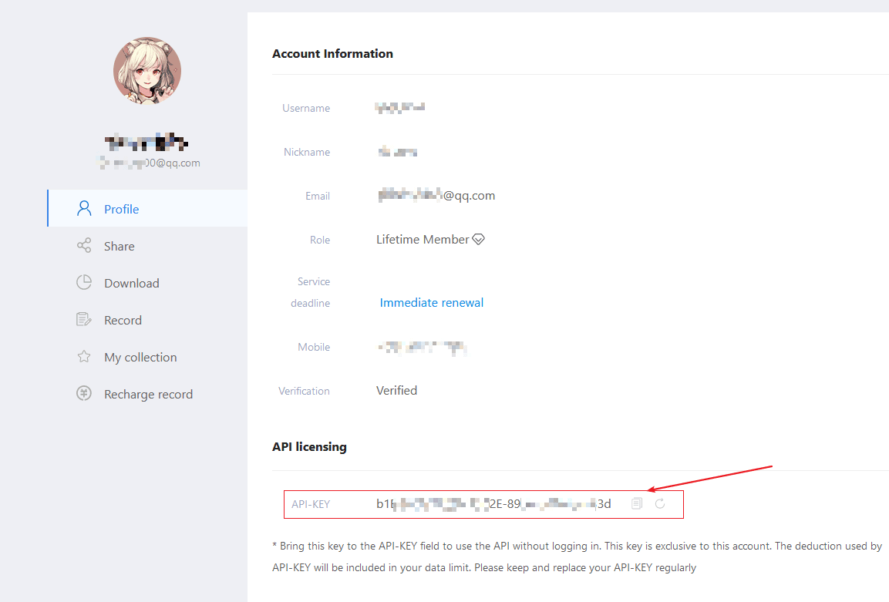
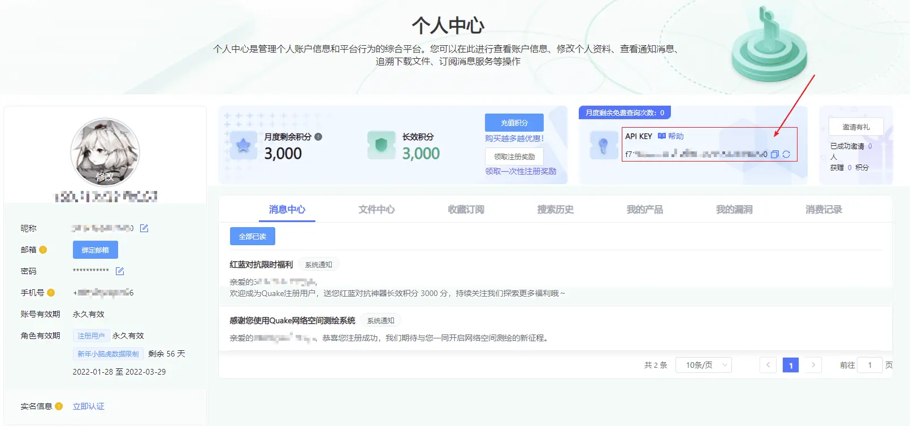
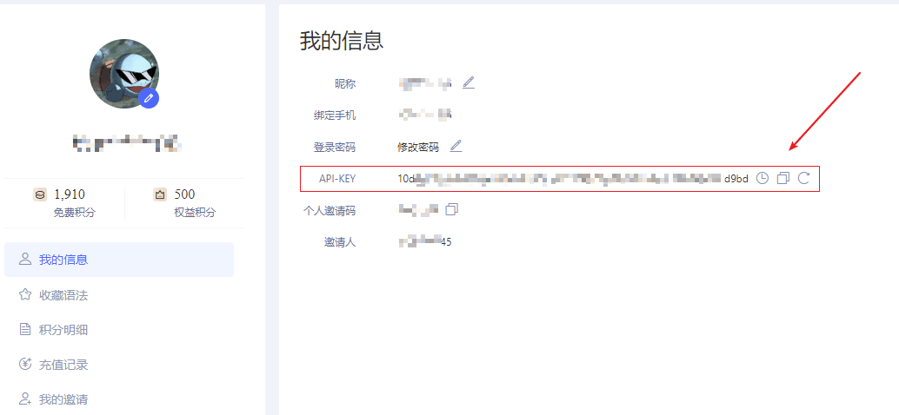
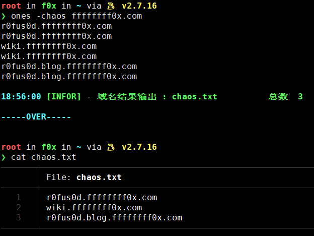
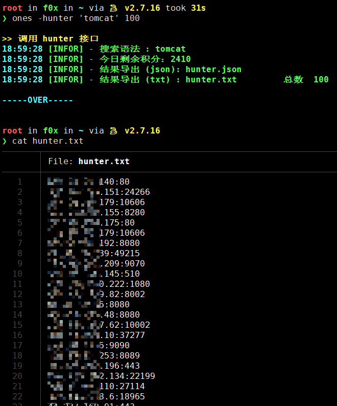
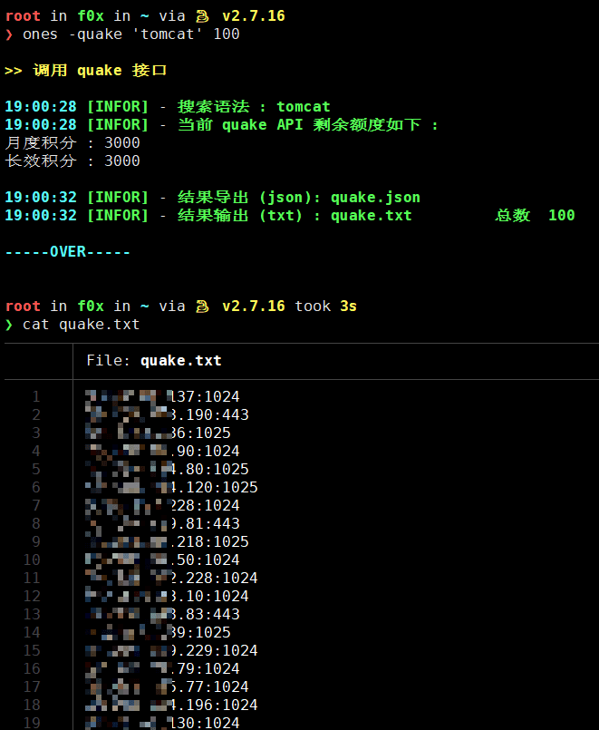
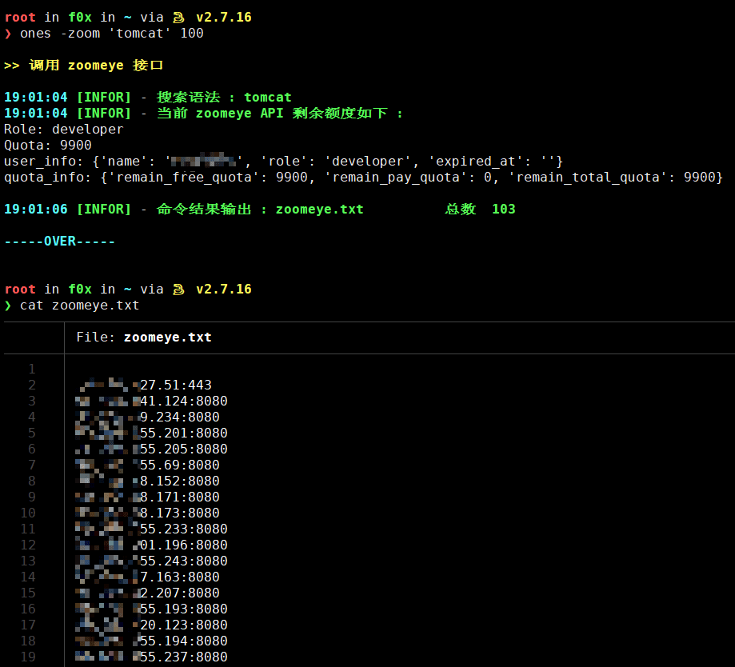
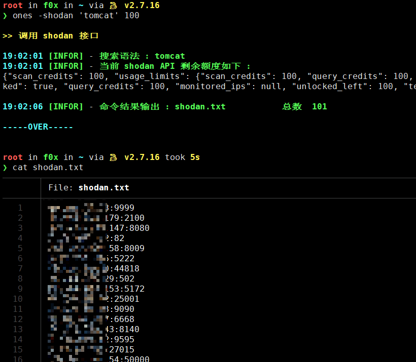

# ones

可用于多个网络资产测绘引擎 API 的命令行查询工具

---

## 开始

**1. 下载**
```bash
wget -O ones https://f8x.io/ones && mv --force ones /usr/local/bin/ones && chmod +x /usr/local/bin/ones
```

**2. 创建配置文件**

将下方字段中的 key 改为你自己的,如果不填就保留默认的 xxxx
```bash
tee /root/ones.conf <<-'EOF'
{
  "fofa_email": "changme@163.com",
  "fofa_key": "xxxxxxxxxxxxxxxxxxxxxxxxxxxxxxx",
  "zoom_key": "xxxxxxxx-xxxx-xxxxx-xxxx-xxxxxxxxxx",
  "shodan_key": "xxxxxxxxxxxxxxxxxxxxxxxxxxxxxxxxx",
  "quake_key": "xxxxxxxx-xxxx-xxxx-xxxx-xxxxxxxxxx",
  "hunter_key": "xxxxxxxxxxxxxxxxxxxxxxxxxxxxxxxxxxxxxxxxxxxxxxxxxxxxxxxxxxxxxxxx",
  "chaos_key": "xxxxxxxxxxxxxxxxxxxxxxxxxxxxxxxxxxxxxxxxxxxxxxxxxxxxxxxxxxxxxxxx"
}
EOF
```

- zoomeye API-KEY
    - https://www.zoomeye.org/profile
    - 

- shodan API-KEY
    - https://account.shodan.io/
    - 

- quake API-KEY
    - https://quake.360.cn/quake/#/personal
    - 

- hunter API-KEY
    - https://hunter.qianxin.com/home/userInfo
    - 

**3. 初始化环境**
```bash
ones -init
```

**4. 使用**

```bash
ones -help
```

**效果**



> 注意 : 初始化不会安装 [chaos](https://github.com/projectdiscovery/chaos-client) ,请自行安装









---

## License

[Apache License 2.0](https://github.com/ffffffff0x/name-fuzz/blob/main/LICENSE)

---

> create by ffffffff0x
